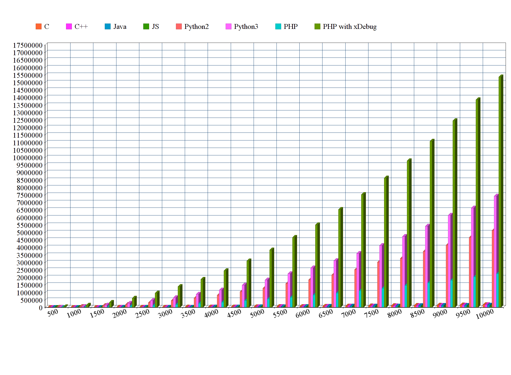
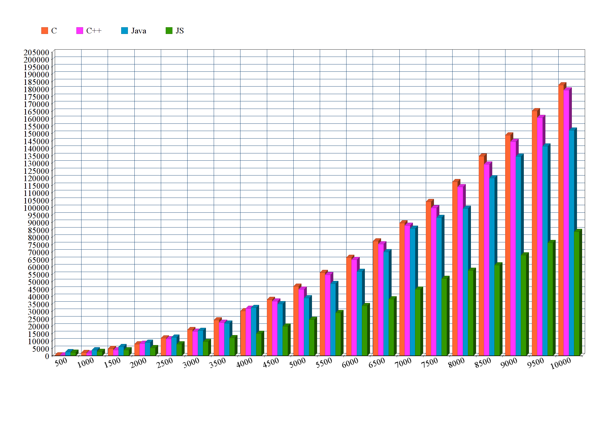

# PerformanceTests
Der Controller testet die Performance verschiender Programmiersprachen, mittels der hinterlegten Algorithmen. Als Beispiel ist der BubbleSort hinterlegt. Die Performancezeiten werden als csv abgespeichert.

# BubbleSort als Pseudo
```
bubbleSort(Array A,int length)
  for (n=length; n>1; --n){
    for (i=0; i<n-1; ++i){
      if (A[i] > A[i+1]){
        tmp = A[i];
        A[i] = A[i+1];
        A[i+1] = tmp;
      } // Ende if
    } // Ende innere for-Schleife
  } // Ende äußere for-Schleife
```
https://de.wikipedia.org/wiki/Bubblesort#Algorithmus

# Systemvoraussetzung
 - Unix
 - C (gcc)
 - C++ (g++)
 - php7
 - node.js
 - python2
 - phython3  
## Erweiterung
### Sprachen
In der controller.php sind in dem Array $languages die Sprachkonfiguration hinterlegt.
 - **ext**: gibt die Endung der Sprache an.
 - **exec**: ist der Execution-Befehl zum Start für die CLI(CommandLine)

### Algorithmen
Neue Algorithmen können ganz einfach eingebunden werden:
 1. vorhandene bubble.(ext)-Datei kopieren. 
 1. Der Kopie den Namen des Algorithmus geben.
 1. In der Kopie den Algorithmus bearbeiten. 

# Ausführung
Ohne Angabe von Parametern werden alle hinterlegten Algorithmen einmal ausgeführt.
``` bash
$ php controller.php [testfunction] [repeats] [output.csv]
```
with check php vs php xDebug
``` bash
$ sudo php controller.php [testfunction] [repeats] [output.csv]
```

# Darstellung
Auf der verlinkten Seite kann man das sich generierte csv graphisch darstellen lassen.
https://www.diagrammerstellen.de/graph?selected_graph=line
#### Bubblesort mit 10 Wiederholungen 500 bis 10000 Elementen
y-Achse in Millisekunden  
x-Achse in Elementen  

