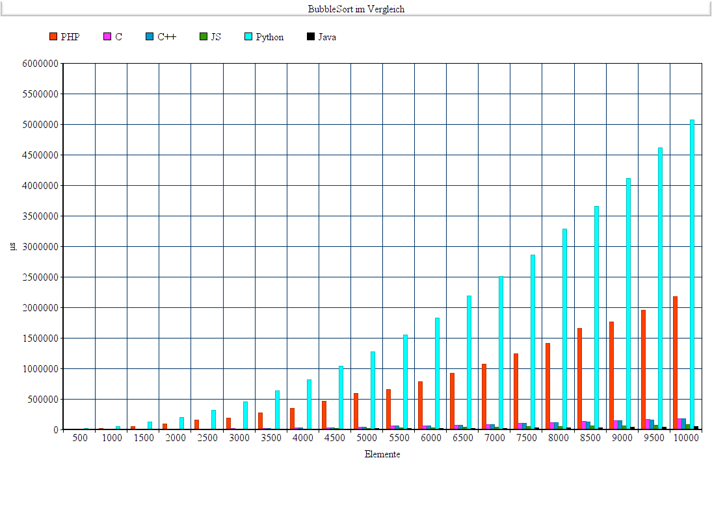

# PerformanceTests
Der Controller testet die Performance verschiender Programmiersprachen, mittels der hinterlegten Algorithmen. Als Beispiel ist der BubbleSort hinterlegt. Die Performancezeiten werden als csv abgespeichert.

# BubbleSort als Pseudo
```
bubbleSort(Array A,int length)
  for (n=length; n>1; --n){
    for (i=0; i<n-1; ++i){
      if (A[i] > A[i+1]){
        tmp = A[i];
        A[i] = A[i+1];
        A[i+1] = tmp;
      } // Ende if
    } // Ende innere for-Schleife
  } // Ende äußere for-Schleife
```
https://de.wikipedia.org/wiki/Bubblesort#Algorithmus

# Ausführung
```
$ php controller.php [testfunction] [repeats] [output.csv]
```

# Darstellung
Auf der verlinkten Seite kann man das sich generierte csv graphisch darstellen lassen.
https://www.diagrammerstellen.de/graph?selected_graph=line


